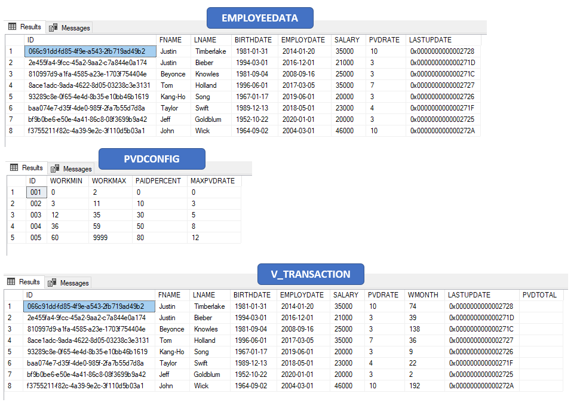
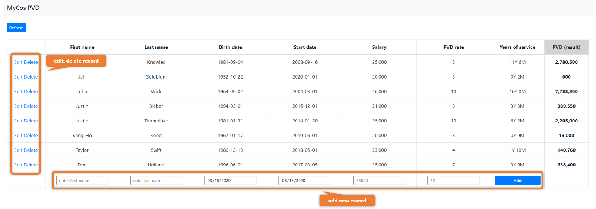
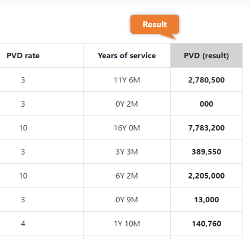

# MycosPvd

## Deveping Information
This system developed based on ASP.NET (.net framwork) with C# language together with Microsoft SQL Server database.

## Tools

1. Microsoft Visual Studio Community 2019
2. SQL Sever Management Studio v18.4
    * For the database, I've already exported sql file for whole database object in `db_file/db_script.sql`

## Database design
This system use 2 tables and 1 view
* Table
    - EMPLOYEEDATA : store employee information (first name, last name, employ date, ...)
    - PVDCONFIG : store the PVD condition
* View
    - V_TRANSACTION : to let webpage call

**figure 1** table & view

## System Screenshot

The system has been developed to be displayed in a tabular format. Which users can add, edit or delete data in the table directly as figure 1

**figure 2** show the ability to interact with users (add new record / edit exists record)

For the result of this system is calculate PVD of employee since the day they start to work to present. So this show at the last column of table as figure 2

**figure 3** show the ability to interact with users (add new record / edit exists record)